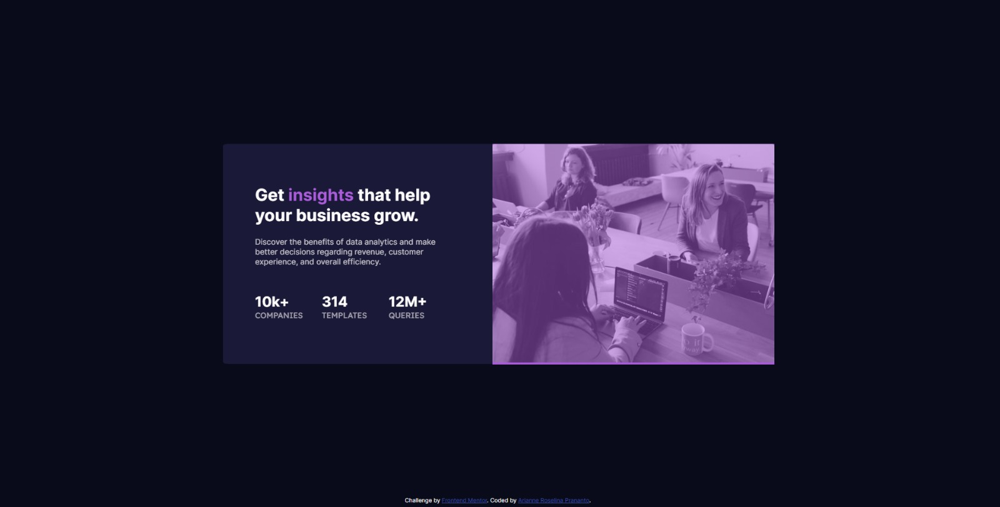

# Frontend Mentor - Stats preview card component solution

This is a solution to the [Stats preview card component challenge on Frontend Mentor](https://www.frontendmentor.io/challenges/stats-preview-card-component-8JqbgoU62). Frontend Mentor challenges help you improve your coding skills by building realistic projects. 

## Table of contents

- [Overview](#overview)
  - [The challenge](#the-challenge)
  - [Screenshot](#screenshot)
- [My process](#my-process)
  - [Built with](#built-with)
  - [What I learned](#what-i-learned)
  - [Continued development](#continued-development)
  - [Useful resources](#useful-resources)
- [Author](#author)

**Note: Delete this note and update the table of contents based on what sections you keep.**

## Overview

### The challenge

Users should be able to:

- View the optimal layout depending on their device's screen size

### Screenshot

## My process

### Built with

- Semantic HTML5 markup
- CSS custom properties
- Flexbox
- CSS Grid
- Visual Studio 2019

### What I learned

As this is my first ever code using CSS and HTML, I found it a bit tricky just to do the simplest commands. I spent about 2 hours just to find the right code to use, so I could center my card properly. I know that my
implementation now is not yet perfect. I haven't checked how it shows up mobile since I only use my desktop to code it, but by doing this I realized that there are still so much to learn and a course is just not enough
without real exercises.

### Continued development

I'm going to develop this even more and implement the mobile view.

### Useful resources

- [W3Schools](https://www.w3schools.com/css/) 
- [CSS Tricks](https://css-tricks.com/)
- [Stack Overflow](https://stackoverflow.com/)

## Author

- GitHub - [@arianneroselina](https://github.com/arianneroselina)
- Frontend Mentor - [@arianneroselina](https://www.frontendmentor.io/profile/arianneroselina)
- LinkedIn - [Arianne Roselina Prananto](www.linkedin.com/in/arianne-roselina-prananto)